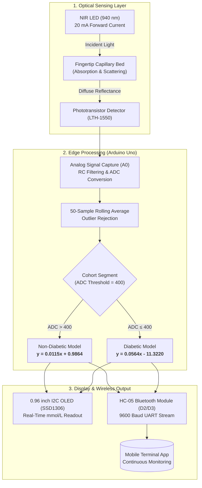

# Development of a Non-Invasive Glucose Monitoring System Using Phototransistor Sensor and Regression Models for Glucose Prediction

[](https://doi.org/10.1109/SPICSCON69221.2025.11504207)
[](https://www.arduino.cc/)
[](https://www.mathworks.com/)
[](LICENSE)
[]()

This repository contains the official firmware, circuit configuration, experimental dataset, and regression calibration scripts for our IEEE-published paper: **"Development of a Non-Invasive Glucose Monitoring System Using Phototransistor Sensor and Regression Models for Glucose Prediction"** (*2025 IEEE International Conference on Signal Processing, Information, Communication and Systems - SPICSCON*)[cite: 13].

---

## Abstract & System Architecture

Frequent blood glucose monitoring is vital for diabetes care, but conventional invasive finger-prick testing incurs physical pain, infection risks, and recurring consumable costs[cite: 13, 16]. This project implements an affordable, non-invasive optical glucose monitor using single-wavelength Near-Infrared (NIR, 940 nm) reflectance spectroscopy coupled with a phototransistor detector (LTH-1550) and edge regression calibration[cite: 13, 15]. The system achieved a coefficient of determination ($R^2$) of 0.5127 compared against an invasive commercial glucometer across 25 human subjects[cite: 13].



---

## Hardware Pinout & Circuit Configuration

| Component / Subsystem | Arduino Uno Pin | Interface Type | Operating Voltage | Function Description |
| :--- | :--- | :--- | :--- | :--- |
| **LTH-1550 (NIR LED Anode)** | `5V` (via $180\Omega$ resistor) | Power Rail | 5V DC (20 mA) | 940 nm optical emission[cite: 13, 18] |
| **LTH-1550 (Phototransistor)** | `A0` | Analog Input | $0 - 5\text{V}$ | Measures diffuse reflected light intensity[cite: 18, 19] |
| **SSD1306 OLED Display** | `A4` (SDA), `A5` (SCL) | I2C (`0x3C`) | 5V / 3.3V | Real-time glucose concentration display (mmol/L)[cite: 18, 19] |
| **HC-05 Bluetooth (TX)** | `D2` | SoftSerial (RX) | 5V TTL | Serial data reception[cite: 18, 19] |
| **HC-05 Bluetooth (RX)** | `D3` | SoftSerial (TX) | 3.3V Logic | Wireless telemetry data transmission[cite: 18, 19] |
| **Push Button** | `D4` | Digital Input | Internal `INPUT_PULLUP` | Acquisition start trigger[cite: 18, 19] |

---

## Mathematical Formulation & Calibration

Light attenuation in biological tissue follows the modified Beer-Lambert Law[cite: 13]:

$$I = I_0 e^{-\mu_{\text{eff}} L}, \quad \mu_{\text{eff}} = \sqrt{3 \mu_a (\mu_a + \mu_s')}$$[cite: 13]

The Arduino computes a 50-sample mean ADC value ($x$) and applies piecewise calibration to estimate blood glucose ($y$, mmol/L)[cite: 13, 19]:

$$y = \begin{cases} 0.0115x + 0.9864, & \text{if } x > 400 \quad \text{(Non-Diabetic Group)} \\ 0.0564x - 11.3220, & \text{if } x \le 400 \quad \text{(Diabetic Group)} \end{cases}$$[cite: 13, 17, 19]

---

## Experimental Results ($N=25$)

Evaluated on 25 volunteers (15 non-diabetic and 10 diabetic, mean age $33 \pm 9$ years) under controlled ambient conditions[cite: 13]:

| Subject ID | Group | Mean Sensor ADC ($x$) | Invasive Glucometer (mmol/L) | Predicted Glucose (mmol/L) |
| :--- | :--- | :--- | :--- | :--- |
| `S01`[cite: 13] | Non-Diabetic[cite: 13] | 509 | 6.80[cite: 13] | 6.84 |
| `S02`[cite: 13] | Non-Diabetic[cite: 13] | 491 | 6.60[cite: 13] | 6.63 |
| `S03`[cite: 13] | Non-Diabetic[cite: 13] | 535 | 6.90[cite: 13] | 7.14 |
| `S04`[cite: 13] | Non-Diabetic[cite: 13] | 483 | 6.50[cite: 13] | 6.54 |
| `S05`[cite: 13] | Non-Diabetic[cite: 13] | 494 | 6.70[cite: 13] | 6.67 |
| `S06`[cite: 13] | Diabetic[cite: 13] | 389 | 8.80[cite: 13] | 10.61 |
| `S07`[cite: 13] | Diabetic[cite: 13] | 380 | 9.80[cite: 13] | 10.11 |
| `S08`[cite: 13] | Diabetic[cite: 13] | 368 | 10.80[cite: 13] | 9.43 |
| `S09`[cite: 13] | Diabetic[cite: 13] | 381 | 11.40[cite: 13] | 10.17 |
| `S10`[cite: 13] | Diabetic[cite: 13] | 397 | 11.60[cite: 13] | 11.07 |

---

## Repository Structure

```text
non-invasive-glucose-monitoring-nir/
├── .gitignore
├── LICENSE
├── README.md
├── src/
│   └── glucose_monitor.ino
├── matlab/
│   └── regression_analysis.m
└── data/
    └── patient_dataset.csv
```

---

## Getting Started

### 1. Arduino Firmware Setup
1. Open `src/glucose_monitor.ino` in the Arduino IDE[cite: 19].
2. Install dependencies via **Library Manager**: `Adafruit SSD1306` and `Adafruit GFX Library`.
3. Select **Arduino Uno** and upload the firmware[cite: 15, 18].
4. Connect via Bluetooth serial terminal (HC-05 default baud: **9600**)[cite: 18, 19].

### 2. MATLAB Verification
1. Open `matlab/regression_analysis.m` in MATLAB[cite: 16].
2. Run the script to generate calibration plots and compute the $R^2$ score against `data/patient_dataset.csv`[cite: 13, 17].

---

## Authors

* **Dip Muhuri** - *Department of Biomedical Engineering, CUET* - [dipmuhuri27@gmail.com](mailto:dipmuhuri27@gmail.com)[cite: 13]
* **Sifat Chowdhury** - *Department of Biomedical Engineering, CUET* - [sifansifat97@gmail.com](mailto:sifansifat97@gmail.com)[cite: 13]
* **Dip Paul** - *Department of Biomedical Engineering, CUET* - [dippaul21dp@gmail.com](mailto:dippaul21dp@gmail.com)[cite: 13]

---

## Citation

```bibtex
@inproceedings{muhuri2025glucose,
  author={Dip Muhuri, Sifat Chowdhury and Dip Paul},
  title={Development of a Non-Invasive Glucose Monitoring System Using Phototransistor Sensor and Regression Models for Glucose Prediction},
  booktitle={2025 IEEE International Conference on Signal Processing, Information, Communication and Systems (SPICSCON)},
  pages={110--114},
  year={2025},
  publisher={IEEE},
  doi={10.1109/SPICSCON69221.2025.11504207}
}
```
