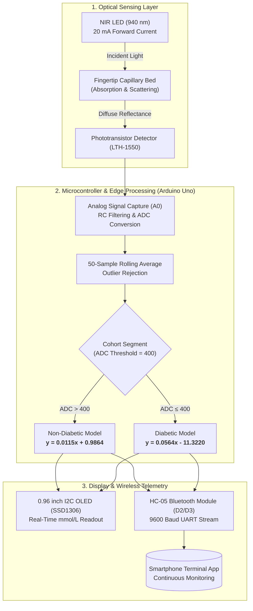

# Development of a Non-Invasive Glucose Monitoring System Using Phototransistor Sensor and Regression Models for Glucose Prediction

[](https://doi.org/10.1109/SPICSCON69221.2025.11504207)
[](https://www.arduino.cc/)
[](https://www.mathworks.com/)
[](LICENSE)
[]()

This repository contains the official firmware, hardware circuit layouts, experimental data, and regression calibration scripts for our IEEE-published paper: **"Development of a Non-Invasive Glucose Monitoring System Using Phototransistor Sensor and Regression Models for Glucose Prediction"** presented at the *2025 IEEE International Conference on Signal Processing, Information, Communication and Systems (SPICSCON)*[cite: 13].

---

## Abstract & System Overview

Frequent blood glucose monitoring is vital for effective diabetes management, but conventional invasive finger-prick testing incurs physical pain, infection risks, and recurring strip costs[cite: 13, 16]. This project presents an affordable, non-invasive optical glucose monitor using single-wavelength Near-Infrared (NIR, 940 nm) reflectance spectroscopy coupled with a phototransistor detector (LTH-1550) and regression-based calibration[cite: 13, 15]. The system was validated against a commercial invasive glucometer across 25 subjects, achieving a coefficient of determination ($R^2$) of 0.5127[cite: 13].



---

## Key Highlights

* **940 nm Spectral Window**: Operates in the second-overtone NIR band (800–1200 nm), reducing spectral interference from dominant water (1450 nm) and protein/lipid absorption bands while utilizing inexpensive silicon optical transducers[cite: 13].
* **Photobiological Safety Compliance**: Operates at 20 mA forward current with an optical power density below $5\text{ mW/cm}^2$, remaining safe for direct human skin contact[cite: 13].
* **Piecewise Linear Calibration**: Incorporates cohort-specific regression curves on the edge microcontroller to account for distinct optical response dynamics in healthy vs. diabetic capillary beds[cite: 13, 19].
* **Real-Time Edge Output**: Transmits immediate glucose predictions (mmol/L) simultaneously to a 0.96" OLED display and via Bluetooth serial stream to Android mobile terminals[cite: 15, 18, 19].

---

## Microcontroller Pin Mapping & Hardware Setup

| Component / Subsystem | Arduino Pin | Interface Type | Operating Voltage | Function Description |
| :--- | :--- | :--- | :--- | :--- |
| **LTH-1550 (NIR LED Anode)** | `5V` (via $180\Omega$ resistor) | Power Rail | 5V DC (20 mA) | 940 nm optical emission[cite: 13, 18] |
| **LTH-1550 (Phototransistor)** | `A0` | Analog Input | $0 - 5\text{V}$ | Measures diffuse reflected light intensity[cite: 18, 19] |
| **SSD1306 OLED Display** | `A4` (SDA), `A5` (SCL) | I2C (`0x3C`) | 5V / 3.3V | Visual real-time glucose readout (mmol/L)[cite: 18, 19] |
| **HC-05 Bluetooth (TX)** | `D2` | SoftSerial (RX) | 5V TTL | Microcontroller data reception[cite: 18, 19] |
| **HC-05 Bluetooth (RX)** | `D3` | SoftSerial (TX) | 3.3V Logic | Wireless telemetry data transmission[cite: 18, 19] |
| **Push Button** | `D4` | Digital Input | Internal `INPUT_PULLUP` | Measurement trigger / Session reset[cite: 18, 19] |

---

## Theoretical Principles & Calibration Model

Light attenuation in diffuse human tissue is governed by the modified Beer-Lambert Law[cite: 13]:

$$I = I_0 e^{-\mu_{\text{eff}} L}$$[cite: 13]

where the effective attenuation coefficient is expressed as[cite: 13]:

$$\mu_{\text{eff}} = \sqrt{3 \mu_a (\mu_a + \mu_s')}$$[cite: 13]

Elevated blood glucose alters tissue refractive index mismatch, increasing optical absorption ($\mu_a$) and reducing reduced scattering ($\mu_s'$), which leads to measurable decreases in reflected intensity ($R$)[cite: 13].

The microcontroller records 50 consecutive ADC samples ($x$), computes the steady-state mean, and applies piecewise regression equations to predict glucose ($y$, in mmol/L)[cite: 13, 19]:

$$y = \begin{cases} 0.0115x + 0.9864, & \text{if } x > 400 \quad \text{(Non-Diabetic Model)} \\ 0.0564x - 11.3220, & \text{if } x \le 400 \quad \text{(Diabetic Model)} \end{cases}$$[cite: 13, 17, 19]

---

## Experimental Dataset & Evaluation ($N=25$)

Evaluated on 25 volunteers (15 non-diabetic and 10 diabetic, mean age $33 \pm 9$ years) under controlled ambient conditions[cite: 13]:

### Paired Clinical Data

| Subject ID | Group | Mean Sensor ADC ($x$) | Invasive Glucometer (mmol/L) | Predicted Glucose (mmol/L) |
| :--- | :--- | :--- | :--- | :--- |
| `S01`[cite: 13] | Non-Diabetic[cite: 13] | 509 | 6.80[cite: 13] | 6.84 |
| `S02`[cite: 13] | Non-Diabetic[cite: 13] | 491 | 6.60[cite: 13] | 6.63 |
| `S03`[cite: 13] | Non-Diabetic[cite: 13] | 535 | 6.90[cite: 13] | 7.14 |
| `S04`[cite: 13] | Non-Diabetic[cite: 13] | 483 | 6.50[cite: 13] | 6.54 |
| `S05`[cite: 13] | Non-Diabetic[cite: 13] | 494 | 6.70[cite: 13] | 6.67 |
| `S06`[cite: 13] | Diabetic[cite: 13] | 389 | 8.80[cite: 13] | 10.61 |
| `S07`[cite: 13] | Diabetic[cite: 13] | 380 | 9.80[cite: 13] | 10.11 |
| `S08`[cite: 13] | Diabetic[cite: 13] | 368 | 10.80[cite: 13] | 9.43 |
| `S09`[cite: 13] | Diabetic[cite: 13] | 381 | 11.40[cite: 13] | 10.17 |
| `S10`[cite: 13] | Diabetic[cite: 13] | 397 | 11.60[cite: 13] | 11.07 |

---

## Repository Structure

```text
├── .gitignore
├── LICENSE
├── README.md
├── docs/
│   ├── IEEE_SPICSCON_Paper.pdf
│   └── Presentation_Slides.pptx
├── hardware/
│   ├── SCH_Schematic.pdf
│   └── PCB_Layout.pdf
├── src/
│   └── glucose_monitor.ino
├── matlab/
│   └── regression_analysis.m
└── data/
    └── patient_dataset.csv
```

---

## Getting Started

### 1. Arduino Firmware Setup
1. Connect the Arduino Uno to your workstation via USB[cite: 15, 18].
2. Open `src/glucose_monitor.ino` in the Arduino IDE[cite: 19].
3. Install required dependencies via **Library Manager**:
   * `Adafruit SSD1306`
   * `Adafruit GFX Library`
4. Select **Tools** $\rightarrow$ **Board** $\rightarrow$ **Arduino Uno** and upload the code[cite: 15, 18].
5. Pair your mobile device to the `HC-05` Bluetooth module (Default PIN: `1234` or `0000`) at **9600 baud** to view real-time data stream[cite: 18, 19].

### 2. MATLAB Analysis & Calibration
1. Open MATLAB and navigate to the `matlab/` folder[cite: 16].
2. Run `regression_analysis.m` to generate the linear calibration curves and compute the $R^2$ score against `data/patient_dataset.csv`[cite: 13, 17].

---

## Authors

* **Dip Muhuri** - *Department of Biomedical Engineering, Chittagong University of Engineering & Technology (CUET)* - [dipmuhuri27@gmail.com](mailto:dipmuhuri27@gmail.com)[cite: 13]
* **Sifat Chowdhury** - *Department of Biomedical Engineering, Chittagong University of Engineering & Technology (CUET)* - [sifansifat97@gmail.com](mailto:sifansifat97@gmail.com)[cite: 13]
* **Dip Paul** - *Department of Biomedical Engineering, Chittagong University of Engineering & Technology (CUET)* - [dippaul21dp@gmail.com](mailto:dippaul21dp@gmail.com)[cite: 13]

---

## Citation

If you use this hardware schematic, code, or experimental dataset in your research, please cite our IEEE conference paper:

```bibtex
@inproceedings{muhuri2025glucose,
  author={Dip Muhuri, Sifat Chowdhury and Dip Paul},
  title={Development of a Non-Invasive Glucose Monitoring System Using Phototransistor Sensor and Regression Models for Glucose Prediction},
  booktitle={2025 IEEE International Conference on Signal Processing, Information, Communication and Systems (SPICSCON)},
  pages={110--114},
  year={2025},
  organization={IEEE},
  doi={10.1109/SPICSCON69221.2025.11504207}
}
```
