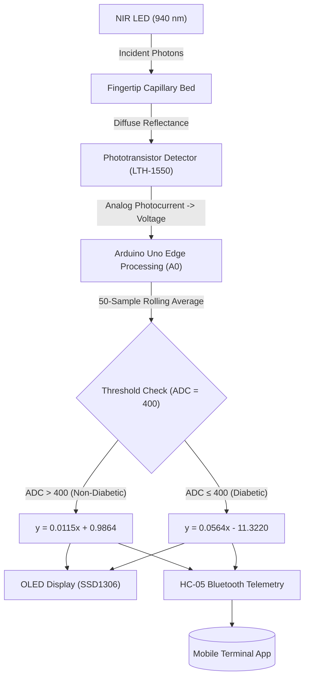

# Development of a Non-Invasive Glucose Monitoring System Using Phototransistor Sensor and Regression Models for Glucose Prediction

[](https://doi.org/10.1109/SPICSCON69221.2025.11504207)
[](https://www.arduino.cc/)
[](https://www.mathworks.com/)
[](LICENSE)

This repository contains the official firmware, hardware schematics, PCB layouts, and calibration scripts for our IEEE-published paper: **"Development of a Non-Invasive Glucose Monitoring System Using Phototransistor Sensor and Regression Models for Glucose Prediction"** presented at the *2025 IEEE International Conference on Signal Processing, Information, Communication and Systems (SPICSCON)*.

---

## Overview

Frequent blood glucose monitoring is essential for diabetes management, yet conventional invasive finger-prick testing incurs physical pain, infection risks, and recurring strip costs[cite: 13, 16]. This project presents an affordable, pain-free non-invasive optical glucose monitor using single-wavelength Near-Infrared (NIR, 940 nm) reflectance spectroscopy coupled with a phototransistor detector and regression-based calibration.



---

## Key Features

* **940 nm Single-Wavelength Sensing**: Operates in the 800–1200 nm optical window to minimize dominant water, protein, and lipid absorption bands while maintaining low cost[cite: 13].
* **Photobiological Safety**: Operates at a forward current of 20 mA with optical power output $< 5\text{ mW/cm}^2$, fully compliant with skin exposure safety thresholds[cite: 13].
* **Edge-Computed Regression**: Microcontroller-level cohort segmentation (Non-Diabetic vs. Diabetic calibration curves) achieving $R^2 = 0.5127$ against an invasive commercial glucometer[cite: 13].
* **Wireless Telemetry & Display**: Dual reporting via a 0.96" I2C OLED display (SSD1306) and 9600-baud UART Bluetooth module (HC-05)[cite: 15, 18, 19].

---

## Hardware Pin Mapping & Circuit Specifications

| Component / Peripheral | Arduino Uno Pin | Protocol / Type | Electrical Specs | Function Description |
| :--- | :--- | :--- | :--- | :--- |
| **LTH-1550 Sensor (Emitter)** | `5V` (via $180\Omega$ resistor) | Analog Power | 20 mA forward current | 940 nm NIR LED illumination[cite: 13, 18] |
| **LTH-1550 Sensor (Collector)**| `A0` | Analog In | $0 - 5\text{V}$ ($180\Omega$ pull-down) | Captures diffuse reflected NIR intensity |
| **OLED Display (SSD1306)** | `A4` (SDA), `A5` (SCL) | I2C (`0x3C`) | 5V / 3.3V | Real-time status and glucose readout[cite: 18, 19] |
| **HC-05 Bluetooth Module** | `D2` (RX), `D3` (TX) | SoftwareSerial | 9600 Baud (5V/3.3V logic) | Streams continuous data to smartphone[cite: 18, 19] |
| **Push Button** | `D4` | Digital In | Internal `INPUT_PULLUP` | User acquisition trigger[cite: 18, 19] |

---

## Mathematical Modeling & Calibration

Light attenuation in biological tissue follows the modified Beer-Lambert and diffuse reflectance relationships[cite: 13]:

$$I = I_0 e^{-\mu_{\text{eff}} L}, \quad \mu_{\text{eff}} = \sqrt{3(\mu_a + \mu_s')}$$[cite: 13]

The digitized sensor voltage ($x$) is averaged over 50 consecutive stable readings and converted into glucose concentration ($y$, mmol/L) using piecewise linear regression[cite: 13, 19]:

$$\text{Predicted Glucose } (y) = \begin{cases} 0.0115x + 0.9864, & x > 400 \quad \text{(Non-Diabetic)} \\ 0.0564x - 11.3220, & x \le 400 \quad \text{(Diabetic)} \end{cases}$$[cite: 13, 17, 19]

---

## Experimental Results ($N=25$)

Testing across 25 subjects (15 non-diabetic, 10 diabetic, mean age $33 \pm 9$ years) demonstrated clear optical contrast tracking reference invasive values[cite: 13]:

### Sample Experimental Data

| Patient No | Subject Category | Mean Sensor ADC ($x$) | Invasive Ref (mmol/L) | Predicted Value (mmol/L) |
| :--- | :--- | :--- | :--- | :--- |
| 1 | Non-Diabetic | 509 | 6.80 | 6.84 |
| 2 | Non-Diabetic | 491 | 6.60 | 6.63 |
| 3 | Non-Diabetic | 535 | 6.90 | 7.14 |
| 4 | Diabetic | 389 | 8.80 | 10.61 |
| 5 | Diabetic | 380 | 9.80 | 10.11 |
| 6 | Diabetic | 397 | 11.60 | 11.07 |

---

## Repository Structure

```text
├── .gitignore
├── LICENSE
├── README.md
├── hardware/
│   ├── schematic.pdf
│   ├── pcb_layout.pdf
│   └── pin_mapping.md
├── src/
│   └── glucose_monitor.ino
├── matlab/
│   └── regression_analysis.m
└── data/
    └── patient_dataset.csv
```

---

## Getting Started

### Arduino Setup
1. Open `src/glucose_monitor.ino` in the Arduino IDE[cite: 19].
2. Install required libraries via Library Manager:
   * `Adafruit SSD1306`
   * `Adafruit GFX Library`
3. Select **Arduino Uno** and upload the sketch (`Ctrl + U`)[cite: 15, 18].
4. Pair mobile Bluetooth terminal to `HC-05` at **9600 baud**[cite: 18, 19].

### MATLAB Analysis
1. Open `matlab/regression_analysis.m` in MATLAB[cite: 16, 17].
2. Ensure `data/patient_dataset.csv` is in the path.
3. Run the script to reproduce linear regression plots and $R^2$ statistics.

---

## Authors

* **Dip Muhuri** - *Department of Biomedical Engineering, CUET* - [dipmuhuri27@gmail.com](mailto:dipmuhuri27@gmail.com)[cite: 13]
* **Sifat Chowdhury** - *Department of Biomedical Engineering, CUET* - [sifansifat97@gmail.com](mailto:sifansifat97@gmail.com)[cite: 13]
* **Dip Paul** - *Department of Biomedical Engineering, CUET* - [dippaul21dp@gmail.com](mailto:dippaul21dp@gmail.com)[cite: 13]

---

## Citation

If you use this work, circuit design, or dataset, please cite our IEEE conference paper:

```bibtex
@inproceedings{muhuri2025glucose,
  author={Muhuri, Dip and Chowdhury, Sifat and Paul, Dip},
  booktitle={2025 IEEE International Conference on Signal Processing, Information, Communication and Systems (SPICSCON)}, 
  title={Development of a Non-Invasive Glucose Monitoring System Using Phototransistor Sensor and Regression Models for Glucose Prediction}, 
  year={2025},
  pages={110--114},
  doi={10.1109/SPICSCON69221.2025.11504207}
}
```
